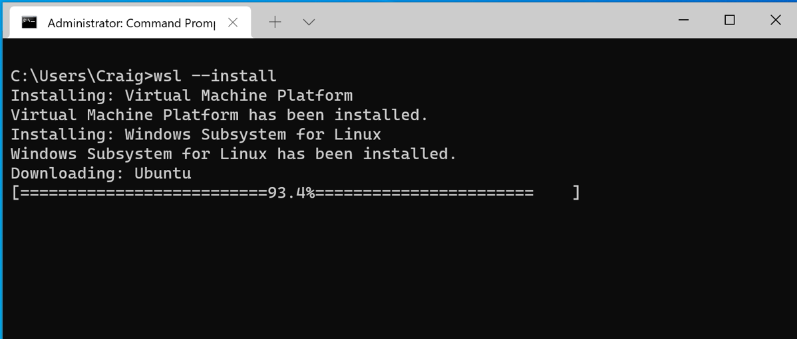
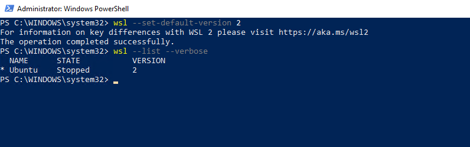
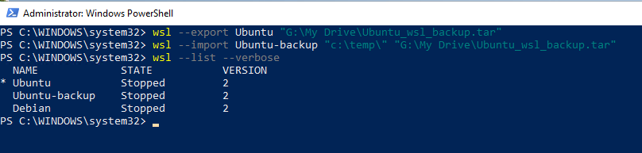
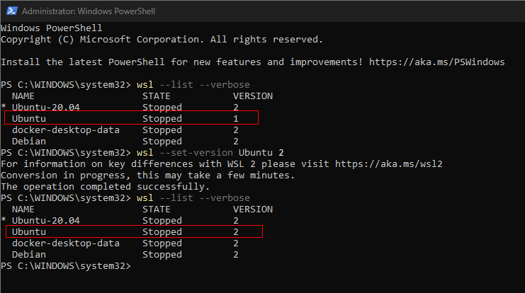

# How to install WSL2 to your computer  (Windows 11) ?

## Installation Process (with PowerShell)
* Start Powershell with Administrator rights (Run as Administrator)

* WSL will be installed to your computer and in the default setting it will download latest Ubuntu
> If you already have wsl installed you should make sure that it is updated. Use command wsl --update to update it.

```powershell
wsl --install
```



## Set default WSL version and check installed distributions
```powershell linenums="1"
wsl --set-default-version 2
wsl --list --verbose
```



##  See a list of the Linux distributions available through the online store.


##  Lets install Ubuntu 20.04 and Debian Distribution. We will use Ubuntu as main platform and Debian for testing.
```powershell linenums="1"
wsl --install --web-download --distribution Ubuntu-20.04

wsl --install --web-download --distribution Debian

wsl --setdefault Ubuntu-20.04
```

#  Updating WSL distribution using Powershell

```powershell linenums="1"
wsl -d Ubuntu -u root bash -c 'apt update ; apt upgrade -y'
wsl -d Ubuntu-20.04 -u root bash -c 'apt update ; apt upgrade -y'
```


## Enabling systemd to your default WSL distribution Ubuntu-20.04
We are starting to use systemd, which brings WSL Linux closer to a virtual machine or physical installation

```powershell linenums="1"
wsl -u root -d Ubuntu-20.04 bash -c "touch /etc/wsl.conf"
wsl -u root -d Ubuntu-20.04 bash -c "echo [boot] >> /etc/wsl.conf" 
wsl -u root -d Ubuntu-20.04 bash -c "echo systemd=true >> /etc/wsl.conf" 
wsl -t Ubuntu-20.04
```
## Limiting amount of memory and cpu WSL can use. Change values as needed
Start Powershell with **NORMAL** user rights and copy all command in to it. 

```powershell linenums="1"
$contentToAdd = @"
[wsl2]
memory=4GB # Limits VM memory in WSL 2 to 4 GB
processors=2 # Makes the WSL 2 VM use two virtual processors
"@

New-Item $home\.wslconfig
Add-Content $home\.wslconfig $contentToAdd
notepad++ $home\.wslconfig 
```

# How to backup WSL and remove it from the machine to save space

## Export and import a Ubuntu distribution to a TAR file

```powershell
wsl --export Ubuntu "G:\My Drive\Ubuntu_wsl_backup.tar"
```

Import a new distribution

```powershell
wsl --import Ubuntu-backup "c:\temp\" "G:\My Drive\Ubuntu_wsl_backup.tar"

```




## Uninstalling command is --unregister
No need to remove WSL distribution if everything is working

```powershell linenums="1"
wsl --unregister Ubuntu-20.04
wsl --unregister Debian
```

# Problem Solving

???+ note "Run Powershell as Administrator"
    Update Windows computer and WSL. Start Powershell with Administrator rights as many times is needed. Go through repairs in order and test regularly.

```powershell title="Update Windows computer and WSL. Run as Administrator." linenums="1"
# Install Windows update modules
Install-Module PSWindowsUpdate -Confirm
Set-ExecutionPolicy -Scope Process -ExecutionPolicy unrestricted
Import-Module PSWindowsUpdate
Get-WindowsUpdate
Install-WindowsUpdate
# Reboot as needed 
Enable-WindowsOptionalFeature -Online -FeatureName Microsoft-Hyper-V -All
```

[Hyper-V still not working? Jump to "Hyper-V still not working?"](#hyper-v-still-not-working) otherwise, move on with WSL install


## Let's check that WSL is installed
```powershell
wsl --install
```

## Update WSL kernel

```powershell
wsl --update
```

## Reinstall Ubuntu, Debian and Docker images. THIS WILL RESULT IN LOST DATA if you have not save data on your host machine!

    
???+ danger "Danger: data lost!"
    THIS WILL RESULT IN LOST DATA if you have not save data on your host machine!
```powershell linenums="1" title="Danger: data lost if...! Reinstall Ubuntu, Debian and Docker images."
Stop-Process -Name "Docker Desktop" -Force
wsl --unregister Ubuntu-20.04
wsl --unregister Ubuntu
wsl --unregister Debian
wsl --unregister docker-desktop-data
wsl --unregister docker-desktop
wsl --set-default-version 2
wsl --install --web-download --distribution Ubuntu-20.04
wsl --install --web-download --distribution Debian
Start-Sleep -Seconds 10 #Waiting WSL to activate
wsl -d Ubuntu-20.04 -u root bash -c 'apt update ; apt upgrade -y'
wsl --setdefault Ubuntu-20.04
```

## Convert WSL 1 to WSL 2

List all installed Ubuntu WSL intance

```powershell
wsl --list --verbose
```

Find what WSL install is running in 1 and convert it to 2

```powershell
wsl --set-version Ubuntu 2
wsl --set-version Ubuntu-20.04 2
```

Fix the default 
```powershell
wsl --set-default-version 2
```




# Hyper-V still not working?

Forcing Hyper-v to start using Windows bootloader. 

* Start Powershell with Adminitrator rights (Run as Administrator).

```powershell
bcdedit /set hypervisorlaunchtype auto
```

More command can be found https://docs.microsoft.com/en-us/windows/wsl/basic-commands