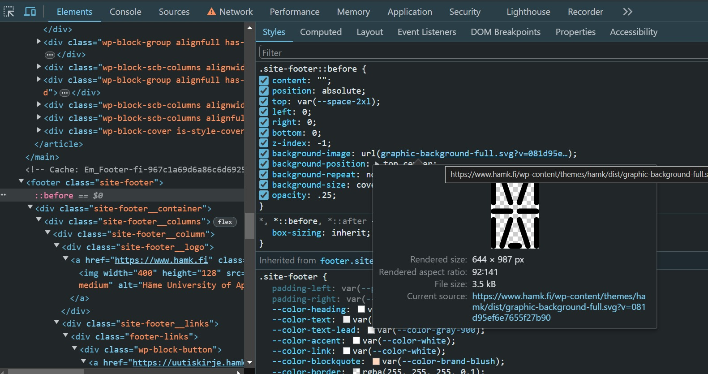
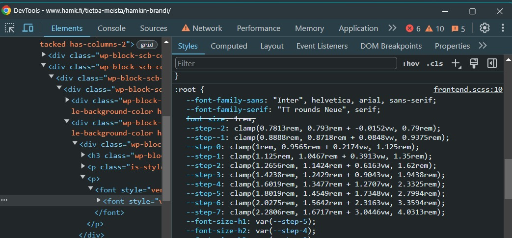

# Documentation for the project
## ✓ 1. Proof of Concept (Mkdocs or Other)
| N. | Question | Answer |
| :-: | - | - |
| 1.1 | Is this good solution? | ✓ |
| 1.2 | Any problems? | ✓ |
| 1.3 | Roadmap of mkdocs | ✓ |
| 1.4 | Any problems in history | ✓ |
| 1.5 | Any future problems? | ✓ |
| 1.6 | What is the relationship between plugins and themes? Which ones go together? | ✓ |

- The future of Material for MkDocs <a href='https://github.com/squidfunk/mkdocs-material/issues/1801' target='_blank'>Sponsorware (sponsors first [insider], then releasing to public when reaching threshold)</a>  

- Switch from Sphrinx to MkDocs <a href='https://towardsdatascience.com/switching-from-sphinx-to-mkdocs-documentation-what-did-i-gain-and-lose-04080338ad38' target='_blank'>Gains and Losts</a>  

## ✓ 2. What theme? Addons? mkdocs-material
Mkdocs or something else?  

| N. | Question | Answer |
| :-: | - | - |
| 2.1 | Is this good solution? | ✓ |
| 2.2 | Any problems? | ✓ in continuous development, bug can happen, but the community and developer are supportive |
| 2.3 | Roadmap of mkdocs | ✓ |
| 2.4 | Any problems in history | ✓ |
| 2.5 | Any future problems? | ✓ |
| 2.6 | What is the relationship between plugins and themes? Which ones go together? | Themes determine the visual appearance and layout. Plugins extend the functionality of MkDocs beyond what is provided by default. |

- Check various themes at <a href='https://github.com/mkdocs/catalog?tab=readme-ov-file#-theming' target='_blank'>https://github.com/mkdocs/catalog #theming</a>  
- <a href='https://docs.readthedocs.io/en/stable/' target='_blank'>Theme ReadTheDoc</a>  

## ✓ 3. Requirements
### ✓ 3.1 Requirements definition
Make BYOD page better  
Details in 4. Goals below
### ✓ 3.2 Input pages
The <a href='https://hamk-business-information-technology.github.io/os/' target='_blank'>current BYOD page</a> and all of its subpages.

## 4. Goals = be better than moodle
### ✓ 4.1 Search
!!! info "documentation: Setting up site search"
    MkDocs-material <a href='https://squidfunk.github.io/mkdocs-material/setup/setting-up-site-search/' target='_blank'>Setting up site search</a>  

```yaml
theme:
  features:
    - search
    - search.sidebar
    - search.suggest
    - search.highlight
    - search.share
# the below was used / not used in this project
plugins: # if plugins off, search still works with the feature settings above
  - search # must be on if plugins on
```

### Documentation for <a href='https://squidfunk.github.io/mkdocs-material/reference/code-blocks/' target='_blank'> code blocks</a>
### Making code blocks
#### by indentation
We are not going to use this option, but using ``` 

    # code block by indentation, - codehilite: linenums: true, and css
    # will remove - codehilite: linenums: true from the yml file
    mkdocs.yml    # The configuration file.
    docs/
       index.md  # The documentation homepage.
       ...       # Other markdown pages, images and other files.
    # suboptimal, lots of workarounds! Following documentation is more efficient!

#### using 3 backticks ```
```title="" linenums="1"
# Code block with ``` (3 backticks)
# for line numbering, use linenums="1"
mkdocs.yml    # The configuration file.
docs/
    index.md  # The documentation homepage.
    ...       # Other markdown pages, images and other files.
```
### ✓ 4.2 Easy to use code copy and paste
!!! info "documentation: Code copy button"
    MkDocs-material <a href='https://squidfunk.github.io/mkdocs-material/reference/code-blocks/#code-copy-button' target='_blank'>Code copy button</a>  
```yaml
theme:
  features:
    - content.code.copy
```

#### Bugs and fixes  
Code block with ```: blank lines automatically added after each line when copied (Some bugs at 9.5.18 fixed at 9.5.22)  
- bug said fixed (<a href='https://github.com/squidfunk/mkdocs-material/commit/34d789bf8223af143a73d1890aa75a1d5005e3f8' target='_blank'>9.5.21</a>) but problem persisting despite latest mkdocs and mkdocs-material update and rebuild -clean  
- this may not be related to <a href='https://github.com/squidfunk/mkdocs-material/issues/3360' target='_blank'>highlighting specific lines adds blank lines when copying</a>   
- safe net <a href='https://github.com/squidfunk/mkdocs-material/issues/7076' target='_blank'>1.5.3</a>  
- done <a href='https://github.com/squidfunk/mkdocs-material/issues/7170' target='_blank'>/issues/7170</a> then 9.5.22 released  

### ✓ 4.3 Code line numbering
!!! info "documentation: adding line number for the code blocks by ```"
    MkDocs-material <a href='https://squidfunk.github.io/mkdocs-material/reference/code-blocks/#adding-line-numbers' target='_blank'>Adding line numbers</a>  
    This add line numbers to specific blocks with this only.
    ```js title=""
    linenums="1" // (1)!
    ```
    
    1. add this code after the 3 backtick (e.g. ``` linenums="1")

!!! info "adding line number for the code blocks by indentation"
    Method for adding line numbers different for the case of code block by indentation (4 indents in each line).  
    Add the following code to mkdocs.yml

???+warning
    This option will add line numbers to all code blocks.
    To selectively add line numbers to a particular blocks, use the above method.
    ```yaml title="mkdocs.yml" linenums="1"
    markdown_extensions:
      - codehilite:
        linenums: true # this is required for the code block by indentation only
    ```

### ✓ 4.4 Highlight entire row
!!! info "documentation"
    MkDocs-material <a href='https://squidfunk.github.io/mkdocs-material/reference/code-blocks/#highlighting-specific-lines-lines' target='_blank'>Code highlighting</a>  

```js title=""
hl_lines="2-5 8" // (1)!
// this will highlight lines 2, 3, 4, 5 and 8
```

1. add this code after the 3 backtick (e.g. ``` hl_lines="2-5 8")

```py title="example with lines 3-5 11 13" linenums="1" hl_lines="3-5 11 13"
# Code block with ``` (3 backticks)
# for line numbering, use linenums="1", to highlight a line, hl_lines=""
mkdocs.yml    # The configuration file.
docs/
   index.md  # The documentation homepage.
   ...       # Other markdown pages, images and other files.
# useful links:
hamk.fi
github.com
# comment
the 11th line is highlighted
# comment
replace the following with your own 'username' and 'password'
```

### ✓ 4.5 In line highlight
!!! info "documentation"
    MkDocs-material <a href='https://squidfunk.github.io/mkdocs-material/reference/code-blocks/#highlighting-inline-code-blocks' target='_blank'>Highlighting inline code blocks</a>  

```yaml title="mkdocs.yml"
markdown_extensions:
  - pymdownx.highlight:
    anchor_linenums: true
  - pymdownx.inlinhilite # in line highlight
  - pymdownx.snipets
```

Examples of inline highlight (inlinehilite):  
1. Here is some code: `#!py3 import pymdownx; pymdownx.__version__`.  
2. The python `#!py range()` function is used to generate a sequence of numbers.  
2b. The python `#!python range()` function is used to generate a sequence of numbers.  
3. The mock shebang will be treated like code here: `#!js var text = 'HAMK';`.  
3b. The mock shebang will be treated like text here: ` #!js var  text = 'HAMK'; `.  
4. Do not expose your `password`.  

### ...4.6 Syntax highlight

!!! info "documentation"
    1. <a href='https://squidfunk.github.io/mkdocs-material/setup/extensions/python-markdown-extensions/?h=syntax+hi#inlinehilite' target='_blank'>MkDocs-material Syntax Highlighting</a>  
    2. details in MkDocs-material <a href='https://squidfunk.github.io/mkdocs-material/setup/extensions/python-markdown-extensions/?h=#highlight' target='_blank'>Python Markdown Extensions Highlight</a>  
    3. A 'solution' <a href='https://github.com/squidfunk/mkdocs-material/issues/138'>work around for php</a>
    4. <a href='https://facelessuser.github.io/pymdown-extensions/extensions/highlight/#syntax-highlighting' target='_blank'>FacelessUser Syntax InlineHilite</a>  
    5. For bash, see the <a href='https://github.com/squidfunk/mkdocs-material/discussions/6504' target='_blank'>discussions/6504</a>  
    6. <a href='https://learn.srlinux.dev/blog/2023/sr-linux-syntax-highlighting-with-pygments/' target='_blank'>SR Linux Syntax Highlighting with Pygments</a>  
    7. Cusomization Pygments with MkDocs-material <a href='https://squidfunk.github.io/mkdocs-material/reference/code-blocks/?h=embedd#custom-syntax-theme'>Custom syntax theme</a>
    

```yaml title="mkdocs.yml"
markdown_extensions:
  - pymdownx.highlight
  - pymdownx.inlinehilite
```

```yaml title="the following is not currently used in this project"
#markdown_extensions:
#  - pymdownx.highlight:
#      anchor_linenums: true
#      line_spans: __span
#      use_pygments: true
#      pygments_lang_class: true
```

bash (suboptimal)  
css ✓  
html (& js) ✓  
java ✓  
js ✓  
json ✓  
php (suboptimal)  
powershell ✓ (?)  
python ✓  
sh (suboptimal)  
yaml ✓  
✓ Done: css, html, java, js, json, powershell, python, yaml (even done, need checking and improving if needed)  
... Suboptimal: bash, php (need the leading '<?php' or '<?'), powershell(?), sh    
<a href='https://github.com/squidfunk/mkdocs-material/issues/138' target='_blank'>work around for php</a>

##### bash (suboptimal)
Currently bash highlighted but suboptimal  
Start at this <a href='https://github.com/squidfunk/mkdocs-material/discussions/6504' target='_blank'>discussion 6504</a> on bash/sh/shell codeblock syntax highlight 
```bash linenums="1"
# this is bash
wsl --set-default-version 2
wsl --list --verbose

wsl -u root -d Ubuntu-24.04 bash -c "touch /etc/wsl.conf"
wsl -u root -d Ubuntu-24.04 bash -c "echo [boot] >> /etc/wsl.conf" 
wsl -u root -d Ubuntu-24.04 bash -c "echo systemd=true >> /etc/wsl.conf" 
wsl -t Ubuntu-24.04

wsl --export Ubuntu "G:\My Drive\Ubuntu_wsl_backup_24.04.tar"

#!/bin/bash
echo "Today is " `date`
echo -e "\nenter the path to directory"
read the_path
echo -e "\n you path has the following files and folders: "
ls $the_path
```

##### css ✓
```css linenums="1"
/*this is css*/
/*HAMK branding colors*/
.md-header {
    background-color: #003755;
    scrollbar-color: #7300F0;
}

/*this is correct, do not remove it*/

.md-tabs {
    background-color: #7300F0;
}
```

##### html (& js)  ✓
```html linenums="1"
<!-- this is html -->
<!DOCTYPE html>
<html>
<body>
<h1>My First Web Page</h1>
<p id="demo">My First Paragraph</p>
<script>
document.getElementById("demo").innerHTML = 5 + 6;
</script>
</body>
</html>
```

##### java ✓

```java linenums="1"
// this is java
public class Main {
  public static void main(String[] args) {
    System.out.println("Hello World");
  }
}
```

##### js ✓
```js linenums="1"
// this is js
document.getElementById("demo").innerHTML = "Hello JavaScript";
```

##### json ✓

```json
{
"name": "Your Name",
"school": "HAMK"
}
```

##### php (suboptimal)
Currently, php highlighted but required `#!php <?`  
'Solution': <a href='https://github.com/squidfunk/mkdocs-material/issues/138' target='_blank'>work around for php</a>  

```php linenums="1"
// this is php
echo "Hello, world!";
function myMessage() {
  echo "Hello world!";
}
myMessage();

// the same code below
// until <? //(1)!
echo "Hello, world!";
function myMessage() {
  echo "Hello world!";
}
myMessage();

```

1. The code in lines `#!py 2-6` are not highlighted. The same code, lines `#!py 10-14`, are higlighted thanks to the [short] opening PHP tag `#!php <?`, even commented as in line `#!py 9`. Missing the tag also inactivates the annotation.

##### powershell ✓
```powershell linenums="1"
# this is powershell
$contentToAdd = @"
[wsl2]
memory=4GB # Limits VM memory in WSL 2 to 4 GB
processors=2 # Makes the WSL 2 VM use two virtual processors
[experimental]
autoMemoryReclaim=true
"@

New-Item $home\.wslconfig
Add-Content $home\.wslconfig $contentToAdd
notepad++ $home\.wslconfig

New-Item -Path 'D:\temp\Test Folder' -ItemType Directory
```

##### python ✓
```py linenums="1"
# this is python
data = 'hello world'
print(data[0])
print(len(data))
print(data)
```

##### sh (suboptimal)
```sh linenums="1"
# this is sh (similar appearance as bash)
wsl --set-default-version 2
wsl --list --verbose

wsl -u root -d Ubuntu-24.04 bash -c "touch /etc/wsl.conf"
wsl -u root -d Ubuntu-24.04 bash -c "echo [boot] >> /etc/wsl.conf" 
wsl -u root -d Ubuntu-24.04 bash -c "echo systemd=true >> /etc/wsl.conf" 
wsl -t Ubuntu-24.04

wsl --export Ubuntu "G:\My Drive\Ubuntu_wsl_backup_24.04.tar"

#!/bin/bash
echo "Today is " `date`
echo -e "\nenter the path to directory"
read the_path
echo -e "\n you path has the following files and folders: "
ls $the_path
```

##### yaml ✓
```yaml
# this is yaml
  language: en
  palette: 
    - scheme: slate # put slate first to make dark mode the default one
      toggle:
        icon: material/toggle-switch
        name: Switch to light mode
        primary: red
        accent: lime
    - scheme: default
      toggle:
        icon: material/toggle-switch-off-outline
        name: Switch to dark mode
        primary: indigo
```

### ✓ 4.7 Code annotation
Each line can host only one annotation.  

!!! info "documentation"
    MkDocs-material <a href='https://squidfunk.github.io/mkdocs-material/reference/code-blocks/#code-annotations' target='_blank'>Code annotation Configuration</a>  
    MkDocs-material <a href='https://squidfunk.github.io/mkdocs-material/reference/code-blocks/#adding-annotations' target='_blank'>Code annotation Usage</a>  

#### bash annotate ✓
```bash linenums="1" hl_lines="3"
# this is bash
wsl --set-default-version 2
wsl --list --verbose # (1)!

wsl -u root -d Ubuntu-24.04 bash -c "touch /etc/wsl.conf"
wsl -u root -d Ubuntu-24.04 bash -c "echo [boot] >> /etc/wsl.conf" 
wsl -u root -d Ubuntu-24.04 bash -c "echo systemd=true >> /etc/wsl.conf" 
wsl -t Ubuntu-24.04

wsl --export Ubuntu "G:\My Drive\Ubuntu_wsl_backup_24.04.tar"

#!/bin/bash
echo "Today is " `date`
echo -e "\nenter the path to directory"
read the_path
echo -e "\n you path has the following files and folders: "
ls $the_path
```

1. this should be more colorful

#### css annotate ✓

```css linenums="1" hl_lines="4"
/*this is css*/
/*HAMK branding colors*/
.md-header {
    background-color: #003755; /* (1)! */
    scrollbar-color: #7300F0;
}

/*this is correct, do not remove it*/

.md-tabs {
    background-color: #7300F0;
}
```

1. this is the background color

#### html (& js) annotate ✓
```html linenums="1" hl_lines="5 8"
<!-- this is html -->
<!DOCTYPE html>
<html>
<body>
<h1>My First Web Page</h1> <!-- (1)! -->
<p id="demo">My First Paragraph</p>
<script>
document.getElementById("demo").innerHTML = 5 + 6; // (2)
</script>
</body>
</html>
```

1. including a h1 element to improve SEO
2. script

#### java annotate ✓

```java linenums="1"  hl_lines="4"
// this is java
public class Main {
  public static void main(String[] args) {
    System.out.println("Hello World"); // (1)!
  }
}
```

1.  testing the annotation

#### js annotate ✓
```js linenums="1"  hl_lines="2"
// this is js
document.getElementById("demo").innerHTML = "Hello JavaScript"; // (1)!
```

1. testing the annotation for js

#### json annotate ✓

```json
{
"name": "Your Name", /*(1)!*/
"school": "HAMK"
}
```

1. Replace with your name

#### php annotate ✓
Currently, php highlighted but required the opening PHP tag <?php  
'Solution': <a href='https://github.com/squidfunk/mkdocs-material/issues/138'>work around for php</a>  

```php linenums="1" hl_lines="10"
// this is php
echo "Hello, world!";
/* not highlighted until leaded by the opening PHP tag, even commented, as shown right below */
function myMessage() {
  echo "Hello world!";
}
myMessage();

// until <?php
echo "Hello, world!"; // (1)!
// this is php
function myMessage() {
  echo "Hello world!";
}
myMessage();
```

1. echo to print to console

#### powershell annotate ✓
```powershell linenums="1" hl_lines="10"
# this is powershell
$contentToAdd = @"
[wsl2]
memory=4GB # Limits VM memory in WSL 2 to 4 GB
processors=2 # Makes the WSL 2 VM use two virtual processors
[experimental]
autoMemoryReclaim=true
"@

New-Item $home\.wslconfig # (1)!
Add-Content $home\.wslconfig $contentToAdd
notepad++ $home\.wslconfig

New-Item -Path 'D:\temp\Test Folder' -ItemType Directory
```

1. Adding new item

#### python annotate ✓
```py linenums="1" hl_lines="3"
# this is python
data = 'hello world'
print(data[0]) # (1)!
print(len(data))
print(data)
```

1. The python print() is to print to terminal

#### sh annotate ✓
```sh linenums="1" hl_lines="14"
# this is sh (similar appearance as bash)
wsl --set-default-version 2
wsl --list --verbose

wsl -u root -d Ubuntu-24.04 bash -c "touch /etc/wsl.conf"
wsl -u root -d Ubuntu-24.04 bash -c "echo [boot] >> /etc/wsl.conf" 
wsl -u root -d Ubuntu-24.04 bash -c "echo systemd=true >> /etc/wsl.conf" 
wsl -t Ubuntu-24.04

wsl --export Ubuntu "G:\My Drive\Ubuntu_wsl_backup_24.04.tar"

#!/bin/bash
echo "Today is " `date`
echo -e "\nenter the path to directory" # (1)!
read the_path
echo -e "\n you path has the following files and folders: "
ls $the_path
```

1. \n to go to next line and print the content after \n (in this example, "enter the path to directory" will be printed in the next line)

#### yaml annotate ✓
```yaml linenums="1" hl_lines="4"
# this is yaml
theme:
  features:
    - content.code.annotate # (1)!
```

1. I'm a code annotation for yaml! I can contain `code`, __formatted
    text__, images, ... basically anything that can be written in Markdown.

#### [deprioritized] annotation inside string (insider only)
Can't reproduce <a href='https://raw.githubusercontent.com/squidfunk/mkdocs-material/master/docs/reference/code-blocks.md' target='_blank'>the job here</a> despite jaml setting done.  
Because <a href='https://squidfunk.github.io/mkdocs-material/reference/code-blocks/#custom-selectors' target='_blank'>this is an insiders feature</a> only available for sponsors.  
Setting for annotation inside string for json
``` json
{
  "key": "value (1)"
}
```

1. json value

```yaml title="mkdocs.yml"
extra:
  annotate:
    json: [.s2] # (1)!
    javascript: [.s2] # (2)!
    java: [.s2] # (3)!
```

1. setting for annotation inside string for json
2. setting for annotation inside string for javascript
3. setting for annotation inside string for java

### ✓ 4.8 HAMK branding elements

!!! info "HAMK documentation"
    1 <a href='https://www.hamk.fi/tietoa-meista/hamkin-brandi/' target='_blank'>hamkin-brandi</a>  
    2 <a href='https://hamk.mediaflowportal.com/mediapankki/' target='_blank'>mediapankki</a>  
    3 <a href='https://www.hamk.fi/en/hamk-renewed-its-brand/' target='_blank'>hamk-renewed-its-brand</a>  
    4 <a href='https://hamk.mediaflowportal.com/folder/754905/' target='_blank'>hamk.mediaflowportal</a>  

#### ✓ HAMK colors (for header, nav, and toc)
???+ note "documentation"
    MkDocs-material <a href='https://squidfunk.github.io/mkdocs-material/setup/changing-the-colors/' target='_blank'>Changing the colors</a> and 
    <a href='https://github.com/squidfunk/mkdocs-material/blob/master/src/templates/assets/stylesheets/main/_colors.scss' target='_blank'>MkDocs root css color variables</a>


```css title="HAMK colors"
HAMK dark blue  = HEX #003755 = rgb(0, 55, 85)
HAMK pink = HEX #7300F0 = rgb(115, 0, 240)
HAMK light pink = HEX #D7AFFF = rgb(215, 175, 255)
```

####  ✓ HAMK logo (& favicon)

???+ note "documentation"
    MkDocs-material <a href='https://squidfunk.github.io/mkdocs-material/setup/changing-the-logo-and-icons/'>Changing the logo and icons</a>

HAMK logo (white on transparent) used as logo and favicon.  
Other HAMK logo, <a href='https://www.hamk.fi/wp-content/themes/hamk/dist/graphic-background-full.svg?v=081d95ef6e7655f27b90'>black on transparent</a>:  
  

Logo and Favicon:  
```yaml title="mkdocs.yml"
theme:
  name: material
  logo: assets/logo_light_pink.png # or logo_white.png
  favicon: assets/favicon/favicon.png
```

#### ✓ HAMK fonts

???+ note "documentation"
    MkDocs-material <a href='https://squidfunk.github.io/mkdocs-material/setup/changing-the-fonts/'>Changing the fonts</a>
Customizing h elements (TT Rounds Neue DemiBold) vs body (Inter) done.  

CSS settings for font families (from the <a href='https://www.hamk.fi/tietoa-meista/hamkin-brandi/' target='_blank'>HAMKin brandi page</a>):  
  

TT Rounds Neu Demibold <a href='../assets/HAMK_Fonts/TT Rounds Neue DemiBold/OTF/Web Fonts/ttroundsneue_demibold_macroman/tt_rounds_neue_demibold-demo.html' target='_blank'>Demo</a>
???+ info "HAMK documentation for TT Rounds Neue DemiBold"
    CSS setting as guided in the HAMK font .zip file <a href='../assets/HAMK_Fonts/TT Rounds Neue DemiBold/OTF/Web Fonts/ttroundsneue_demibold_macroman/stylesheet.css' target='_blank'>tt_rounds_neue_demibold</a> and <a href='../assets/HAMK_Fonts/TT Rounds Neue DemiBold/OTF/Web Fonts/ttroundsneuecondensed_demibold_macroman/stylesheet.css' target='_blank'>tt_rounds_neue_condensed_demibold</a>

```css title="TT Rounds Neue DemiBold, actual settings of this site"
:root { /* from the hamkin-brandi page, together with guidance in the .pptx file */
    --font-family-sans: 'Inter', Helvetica, Arial, sans-serif; 
    --font-family-serif: 'TT Rounds Neue DemiBold', 'Arial Rounded MT', serif; 
}
@font-face {/* adapted from the HAMK font .zip file */
    font-family: 'TT Rounds Neue DemiBold';
    src: url('../assets/tt_rounds_neue_demibold-webfont.woff2') format('woff2'),
         url('../assets/tt_rounds_neue_demibold-webfont.woff') format('woff');
    font-weight: normal;
    font-style: normal;
}

@font-face {/* from the HAMK font .zip file. The Condensed (Narrowed) is not used */
    font-family: 'TT Rounds Neue Condensed DemiBold';
    src: url('../assets/tt_rounds_neue_condensed_demibold-webfont.woff2') format('woff2'),
         url('../assets/tt_rounds_neue_condensed_demibold-webfont.woff') format('woff');
    font-weight: normal;
    font-style: normal;
}
```

```yaml title="Inter (from Google Font), actual settings of this site"
extra_css:
  - https://fonts.googleapis.com/css2?family=Inter:wght@400;700&display=swap
```

Sample texts from the <a href='https://www.hamk.fi/tietoa-meista/hamkin-brandi/' target='_blank'>HAMKin brandi page</a> to view and compare  

**Hämeen ammattikorkeakoulu (HAMK) on oppimis- ja tutkimusyhteisö tekijöille, jotka haluavat muuttaa maailmaa.** Meitä on noin 10 000 biotalouden, hyvinvoinnin, koulutuksen, liiketoiminnan, muotoilun ja teknologian tulevaisuuden tekijää. Toimimme seitsemällä kampuksella, verkossa ja kansainvälisesti. Opiskelijoille, henkilöstölle ja yhteistyökumppaneillemme tarjoamme erinomaiset työkalut ja ympäristöt tehdä työtä ja hyödyllisiä tekoja yhdessä.  

Suomenkielistä logoversiota käytetään suomenkielisissä yhteyksissä ja englanninkielistä englanninkielisissä. Käyttötilanteissa, joissa on sekä suomen- että vieraskielisiä yleisöjä (esim. opasteet, kyltit) käytetään ensisijaisesti englanninkielistä versiota.

### ✓ 4.9 Dark mode as default

???+ note "documentation"
    MkDocs-material <a href='https://squidfunk.github.io/mkdocs-material/setup/changing-the-colors/#color-palette-toggle'>Color palette toggle</a>

To set dark mode as default:  
put - scheme: slate as the 1st scheme in palette (when the user first visits our site, the media queries are evaluated in the order of their definition.)  
See also <a href='./#74-deprioritized-switch-to-system-preference-beside-the-dual-dark-light'> 7.4 Switch to 'system preference' beside the dual dark / light</a>

### ✓ 4.10 Send email feedback button
Current Feedback button in the old BYOD site:
```html
<a class="email" title="Submit feedback" href="#" onclick="javascript:window.location='mailto:deepak.curator@gmail.com?subject=HAMK New Byod feedback&amp;body=I have some feedback about the page titled ' + encodeURIComponent(document.title) + ' at the URL: ' + encodeURIComponent(window.location.href);"><i class="fa fa-envelope-o"></i> Feedback</a>
```
<a class="email" title="Submit feedback" href="#" onclick="javascript:window.location='mailto:deepak.curator@gmail.com?subject=HAMK New Byod feedback&amp;body=I have some feedback about the page titled ' + encodeURIComponent(document.title) + ' at the URL: ' + encodeURIComponent(window.location.href);"><i class="fa fa-envelope-o"></i> Feedback</a> 

Solution for Mkdocs:  
Set separate js to incorporate the button to footer:  
```js
document.addEventListener('DOMContentLoaded', function() {
    const ellipsisContainer = document.querySelector('.md-search');
    if (ellipsisContainer) {
        const mailtoLink = document.createElement('a');
        mailtoLink.href = '#';
        mailtoLink.classList.add('custom-email-link');

        // Create a text node saying 'Feedback''
        const textNode = document.createTextNode('Feedback');

        // Create an icon element
        const icon = document.createElement('i');
        icon.classList.add('far', 'fa-envelope'); // 'far' for Regular (outlined) envelope, 'fas' for solid (S)
        icon.setAttribute('aria-hidden', 'true');

        // Append the icon and text node to the link element
        mailtoLink.appendChild(icon);
        mailtoLink.appendChild(textNode);

        mailtoLink.addEventListener('click', function(event) {
            event.preventDefault();
            const subject = 'HAMK New BYOD feedback';
            const body = `I have some feedback about the page titled: ${document.title} at the URL: ${window.location.href}`;
            const mailtoURL = `mailto:deepak.curator@gmail.com?subject=${encodeURIComponent(subject)}&body=${encodeURIComponent(body)}`;
            window.location.href = mailtoURL;
        });
        ellipsisContainer.appendChild(mailtoLink);
    }
});
```

### ✓ 4.11 Integration to videoplatform   
???+ note "documentation"
    See the discussion at <a href='https://github.com/squidfunk/mkdocs-material/discussions/3984' target='_blank'>discussions/3984</a>  
##### GOOGLE DRIVE
```html title="In the .md file, attn to the src syntax ending 'preview' for googledrive"
<div class='video-container'> <!--(1)!-->
  <iframe src='https://drive.google.com/file/d/[FILE_ID]/preview' allowfullscreen></iframe>
</div>
```

1. /file/d/[FILE_ID]/preview

```css title="css for the video frame"
.video-container {
    position: relative; /* allows the iframe element inside it to be positioned relative to this container. */
    width: 100%; /* makes the container take up 100% of the width of its parent element */
    padding-bottom: 56.25%; /* 16:9 aspect ratio */
    height: 0; /*  height set to 0 because padding is used to define the aspect ratio of the container */
    overflow: hidden; /* ensures that the iframe content doesn't spill out of the container */
    max-width: 100%; /* ensures the container doesn't grow larger than its parent element, maintaining responsive behavior. */
    background: #000; /* placeholder color before the video loads */
}
.video-container iframe {
    position: absolute; /* sets the position of the iframe to absolute, so it will be positioned relative 
        to the nearest positioned ancestor (in this case, .video-container which is set to relative above) */
    top: 0; /* positions the top edge of the iframe at the top of the container*/
    left: 0; /* positions the left edge of the iframe at the left of the container */
    width: 100%; /* makes the iframe take up 100% of the width of the container */
    height: 100%; /* makes the iframe take up 100% of the height of the container. */
    border: 0; /* removes any default border that might be applied to the iframe */
}
```
The Working Solution, responsive: `iframe in div with css`:  
<div class='video-container'>
  <iframe src='https://drive.google.com/file/d/1uGRddSym1KbVSJit2DNoMiAGE4uakcY7/preview' allowfullscreen></iframe>
</div>
[Do not use] iframe with `width=100% height=auto`:  
<iframe src='https://drive.google.com/file/d/1uGRddSym1KbVSJit2DNoMiAGE4uakcY7/preview' allowfullscreen width=100% height='auto'></iframe>  
[Do not use] iframe `style='width: 100%; height: 100%;'` :  
<iframe src='https://drive.google.com/file/d/1uGRddSym1KbVSJit2DNoMiAGE4uakcY7/preview' allowfullscreen style='width: 100%; height: 100%;'></iframe>

##### YOUTUBE

```html title="https://www.youtube.com/EMBED/videoID"
The Working Solution, responsive: `iframe in div with css`:  
<div class='video-container'> <!--(1)!-->
  <iframe src='https://www.youtube.com/embed/CF6ZGbz59gE' allowfullscreen></iframe>
</div>
```

1. add /embed/ to the code

The Working Solution, responsive: `iframe in div with css`:  
<div class='video-container'>
  <iframe src='https://www.youtube.com/embed/smbX1wHhGjs' allowfullscreen></iframe>
</div>

## 5. Fantasy
### 5.1 .zip button to download file
#### 5.1.1 Offline plugin: to distribute our documentation
Our documentation can be distributed as a smaller `.zip` download
???+ "documentation"
    MkDocs-material <a href='https://squidfunk.github.io/mkdocs-material/plugins/offline/' target='_blank'>Offline plugin</a>  

#### 5.1.2 For bug reporting:

This feature is solely intended to create reproductions for bug reports. When the built-in info plugin is enabled, MkDocs will add all relevant files to a `.zip`, print a summary to the terminal and exit.

???+ ".zip file for bug reporting"
    See the documentation about <a href='https://squidfunk.github.io/mkdocs-material/guides/creating-a-reproduction/?h=zip#creating-a-zip-file' target='_blank'>creating a .zip file</a> to creating a reproduction for bug reporting.

```yaml title="mkdocs.yml"
plugins:
  - info
```
### 5.2 VM integration

## 6. Tech notes
### 6.1 CSS: 
Central CSS (root):  
site\assets\stylesheets (govern light and dark mode)  
Custom CSS (custom.css)  

### 6.2 Code block with ``` better supported than by indentation

### 6.3 Navigation bar (left side) and TOC (right side)

???+ info "Documentation"
    <a href='https://squidfunk.github.io/mkdocs-material/setup/setting-up-navigation/#table-of-contents' target='_blank'>#table-of-contents</a>. Examples:  
    - <a href='https://squidfunk.github.io/mkdocs-material/contributing' target='_blank'>mkdocs-material community</a>  
    - <a href='https://blog.pypi.org/' target='_blank'>pypi blog</a>  

???+ info
    Standard mkdocs-material terms: nav (right side bar), toc (left side bar).  
    "Left panel for navigating between subpages, right panel for current page TOC."  
    Hamburger nav bar = <a href='https://github.com/squidfunk/mkdocs-material/discussions/3210' target='_blank'>Hamburger left menu?</a>  
    -->Using <a href='https://squidfunk.github.io/mkdocs-material/setup/setting-up-navigation/' target='_blank'>Collapsible navigation</a> instead.  

```yaml
theme:
  features:
    - navigation.expand
```

For small site, use the following setting to integrate the toc to the left side.
```yaml title="mkdocs.yml"
theme:
  features:
    - toc.integrate
```
For webservers that need both nav and toc, comment it out.  
Nav and toc can be hidden by adding the following lines at the top of a Markdown file:
```
---
hide:
  - navigation
  - toc
---

# Page title (as the 1st h1 element)
...
```

### 6.4 Changing the color
<a href='https://squidfunk.github.io/mkdocs-material/setup/changing-the-colors/' target='_blank'>Changing the color</a>  

## 7. Curiosity and Ideas
<a href='' target='_blank'></a>  

### Always test, Do not assume
### ✓ 7.1 Mobile friendliness lost with code line numbering (4 indents - codehilite: linenums: true, and css) [solved]
#### No problem if code block generated by ```
Original sites with code blocks (no line numbering) are mobile friendly: MkDocs-material <a href='https://squidfunk.github.io/mkdocs-material/reference/' target='_blank'>References</a> or <a href='https://luonghuyquang.github.io/mkdocs-material-q-hamk/' target='_blank'>Initial experiment</a>  
### ✓ 7.2 Nav and TOC see <a href='./#63-navigation-bar-left-side-and-toc-right-side'>Tech note 6.3</a>
???+ info
    Standard mkdocs-material terms: nav (right side bar), toc (left side bar).
    TOC can be integrated into the right side nav bar (consideration for small sites).
#### Submenu:  
???+ Note "Submenu"
    BYOD (as small page): doesn't need  
    Other (larger) webservers: yes  
    To navigate among subpages:  
    - anchoring  
    - floating  
    - simple home logo to click on  

### 7.3 [deprioritized] Analytics & SEO (!!! GDPR, not prioritized)
Analytic tools, number of users, time of use, heatmap etc.  
(Moodle has its activity tracker)  
Indexed by SEs such as Google  

### 7.4 [deprioritized] Switch to 'system preference' beside the dual dark / light

???+ note "documentation"
    - MkDocs-material <a href='https://squidfunk.github.io/mkdocs-material/setup/changing-the-colors/#automatic-light-dark-mode' target='_blank'>Automatic light / dark mode</a>

Example of page using this:  
- <a href='https://squidfunk.github.io/mkdocs-material/' target='_blank'>material for MkDocs</a>  


### ? MkDocs material page itself
The page does not allow ping or tracert  
The picture rendered as <a href='https://squidfunk.github.io/mkdocs-material/assets/images/wall.png' target='_blank'>https://squidfunk.github.io/mkdocs-material/assets/images/wall.png</a>  
but not found at <a href='https://github.com/squidfunk/mkdocs-material/tree/master/docs/assets/images' target='_blank'>https://github.com/squidfunk/mkdocs-material/tree/master/docs/assets/images</a> nor at the parent folder <a href='https://github.com/squidfunk/mkdocs-material' target='_blank'>https://github.com/squidfunk/mkdocs-material</a> 


### ✓ 7.5 More tools to use
Just check the <a href='https://squidfunk.github.io/mkdocs-material/' target='_blank'>Documentation</a>, particularly:   

- <a href='https://squidfunk.github.io/mkdocs-material/setup/' target='_blank'>Setup</a>  
  >- Markdown <a href='https://squidfunk.github.io/mkdocs-material/setup/extensions/?h=markdown' target='_blank'>Extensions</a>  

- <a href='https://squidfunk.github.io/mkdocs-material/plugins/' target='_blank'>Plugins</a>  
- <a href='https://squidfunk.github.io/mkdocs-material/reference/' target='_blank'>Reference</a>:  
  > - <a href='https://squidfunk.github.io/mkdocs-material/reference/admonitions/#admonitions' target='_blank'>Admonitions</a> to use: <a href='https://squidfunk.github.io/mkdocs-material/reference/admonitions/#+type:warning' target='_blank'>Warning,</a> Abstract, Bug, Danger, Example, Info, Note, Question, Quote, Success, Tip.
  > - Code can be inside an admonition, see examples in <a href='./#43-code-line-numbering'>4.3 above</a>


!!! warning "content always displayed"
    Content always displayed  
    Use "customized title" to give a title to the admonition  
    Use !!! to start an admonition

??? note "content hidden by default and need to click to the right to open"
    Use ??? to start an admonition

???+ danger "content displayed by default and can click to the right to hide"
    Use ???+ to start an admonition

- <a href='https://squidfunk.github.io/mkdocs-material/reference/diagrams/#using-flowcharts' target='_blank'>Flowcharts</a> and many types of <a href='https://squidfunk.github.io/mkdocs-material/reference/diagrams/#using-sequence-diagrams' target='_blank'>diagrams</a>  
- <a href='https://squidfunk.github.io/mkdocs-material/setup/extensions/python-markdown/?h=permalink#+toc.permalink' target='_blank'>Permalink</a> (`permalink`) inserts an anchor link with the symbol ¶ at the end of each headline, directly link to a subpart of the document, for easy sharing.
```yaml title="mkdocs.yml to use permalink"
markdown_extensions:
  - toc:
      permalink: true
```

### 7.6 Iframe and Embedding pdf

<iframe src='../assets/pdf/poster_mi24_final.pdf' width=100% height=700px>This browser does not support PDFs. Please download the PDF to view it: <a href='../assets/pdf/poster_mi24_final.pdf'>Download PDF</a>
</iframe>